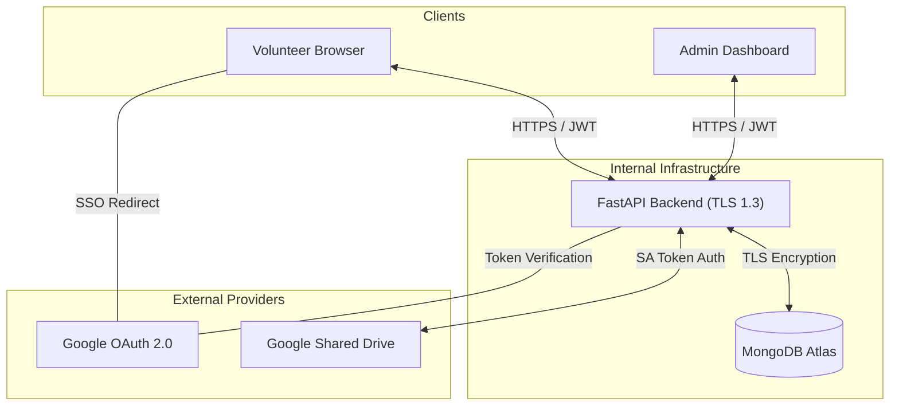

# Guardian's Embrace: Security Architecture & Data Flow
**Project:** Volunteer Portal  
**Document Status:** Release Candidate 1.0  
**Date:** March 2026

---

## 1. Executive Summary
The **Guardian's Embrace Volunteer Portal** is a decoupled web application designed to facilitate volunteer contributions while maintaining high standards for data integrity and organizational security. This document outlines the technical architecture, data flow paths, and security controls implemented to protect volunteer identity and organizational assets.

---

## 2. High-Level Architecture
The system utilizes a modern technology stack optimized for security, portability, and scalability:

*   **Frontend:** React 18 / TypeScript / Vite.
*   **Backend:** FastAPI (Python 3.12) REST API.
*   **Database:** MongoDB (NoSQL) for metadata and state storage.
*   **Storage:** Google Drive API (Shared Drive via Service Account).
*   **Identity Provider:** Google OAuth 2.0 (OpenID Connect).

### 2.1 System Interconnectivity (Logical View)

---

## 3. Data Flow Analysis

### 3.1 Authentication Strategy (OIDC)
The portal employs a **passwordless architecture**. We do not store or process raw credentials, delegating identity verification to a trusted provider.

1.  **Identity Initiation:** User initiates login via Google SSO on the frontend.
2.  **External Validation:** Google returns a secure token (`id_token`) to the client.
3.  **Backend Verification:** The frontend transmits the token to the backend `/auth/google` endpoint.
4.  **Token Integrity Check:** The backend verifies the token and retrieves user metadata directly from Google's `userinfo` endpoint.
5.  **Session Issuance:** Upon successful validation, the backend issues a signed **JWT (HS256)** with a 7-day expiration for subsequent portal requests.

### 3.2 Secure File Ingestion Flow
Volunteer work snapshots and documents are handled via a proxied streaming mechanism to avoid persistent local storage.

| Flow Stage | Action | Security Control |
| :--- | :--- | :--- |
| **Ingress** | Volunteer uploads work snapshot (max 25MB) | MIME type validation & size enforcement |
| **Validation** | Backend verifies User Role and Project context | RBAC (Role-Based Access Control) |
| **Streaming** | Content is streamed directly to Google Shared Drive | TLS 1.2+ Transit Encryption |
| **Storage** | Files stored in organizational Shared Drive | Google Cloud Managed Encryption (at Rest) |
| **Sanitization** | No permanent files are kept on the API server disk | Automated temp-file cleanup policy |

---

## 4. Data Classification & Privacy
Understanding where sensitive data resides is critical for privacy compliance (e.g., GDPR/CCPA).

| Data Type | Classification | Storage Location | Retention Policy |
| :--- | :--- | :--- | :--- |
| **Volunteer Identity** | PII (Highly Sensitive) | MongoDB / Google OAuth | Permanent until account deletion |
| **Email Address** | PII (Sensitive) | MongoDB (Encrypted at rest) | Permanent |
| **Work Submissions** | Confidential | MongoDB (Metadata) | Project lifecycle |
| **Uploaded Files** | Confidential | Google Shared Drive | Organizational policy |
| **JWT Secrets** | Secret (Restricted) | Environment Variables | Rotated periodically |

---

## 5. Identity & Access Management (IAM)

### 5.1 Principle of Least Privilege
The system uses a **Google Service Account** for all file operations. To minimize risk:
*   **Scope Restriction:** The SA is limited to `https://www.googleapis.com/auth/drive` but is only granted permissions on the **specific Shared Drive** used by the portal.
*   **Role Constraint:** The SA is assigned as a **Content Manager**, meaning it cannot modify drive permissions, delete the drive itself, or access the organization's wider Google Workspace (Email, Calendar, etc.).

### 5.2 Internal Role-Based Access Control (RBAC)
| Role | Permissions | Authorization Level |
| :--- | :--- | :--- |
| **Volunteer** | Create submissions, list own files, view own profile. | Standard |
| **Team Lead** | View team submissions, download files, comment. | Elevated |
| **Admin** | Manage users, view all data, configure portal settings. | Full Administrative |

---

## 6. API Threat Mitigation Map

| Threat Vector | Mitigation Strategy | Implementation |
| :--- | :--- | :--- |
| **Injection (SQL/NoSQL)** | Parameterized I/O | Use of Beanie ODM and Pydantic validation. No raw query concatenation. |
| **Broken Authorization** | Middleware Enforced | `get_current_user` dependency required on 100% of non-public routes. |
| **Broken Authentication** | Delegated Auth | Outsourcing auth to Google OAuth 2.0 removes the risk of password database leaks. |
| **Sensitive Data Exposure** | DTO Clipping | Separate "Request" and "Response" models ensure sensitive fields (like internal IDs or tokens) never leave the server. |
| **Rate Limiting** | Infrastructure Level | (Deploy-time) Suggest AWS WAF or Nginx `limit_req` for auth endpoints. |

---

## 7. Verification Evidence & Audit Artifacts
Security teams can verify the implementation through:
1.  **OpenAPI Schema:** Available at `/api/docs` (interactive Swagger UI) or `/api/openapi.json`.
2.  **Audit Logs:** Application logs include Correlation IDs and User-IDs for all state-changing operations.
3.  **Environment Audit:** `.env.example` provides a template of all required configurations without exposing secrets.

---

## 8. Risk Mitigation & Resilience
*   **Database Resilience:** MongoDB Atlas automated snapshots and point-in-time recovery.
*   **Storage Fallback:** In the event of a Google Drive API outage, the system utilizes a circuit-breaker to store files in an encrypted local volume temporarily, with automated re-sync functionality once connectivity is restored.
*   **Input Protection:** NoSQL injection prevention is handled at the ODM layer (Beanie) through parameterized queries.

---

## 9. Security Control Matrix

| Control Category | Implementation Detail | Status |
| :--- | :--- | :--- |
| **Transport Security** | TLS 1.2+ required for all API communication. | **Active** |
| **Data Integrity** | Pydantic models for strict I/O schema enforcement. | **Active** |
| **Unauthorized Access** | JWT middleware blocks all unauthenticated requests. | **Active** |
| **Secrets Management** | API Keys and Secrets stored in environment variables. | **Standard** |
| **Audit Trails** | Request logging with User-ID and Correlation IDs. | **Active** |

---

> **Confidentiality Notice:** This document is intended for internal cybersecurity review. Unauthorized distribution is prohibited.
