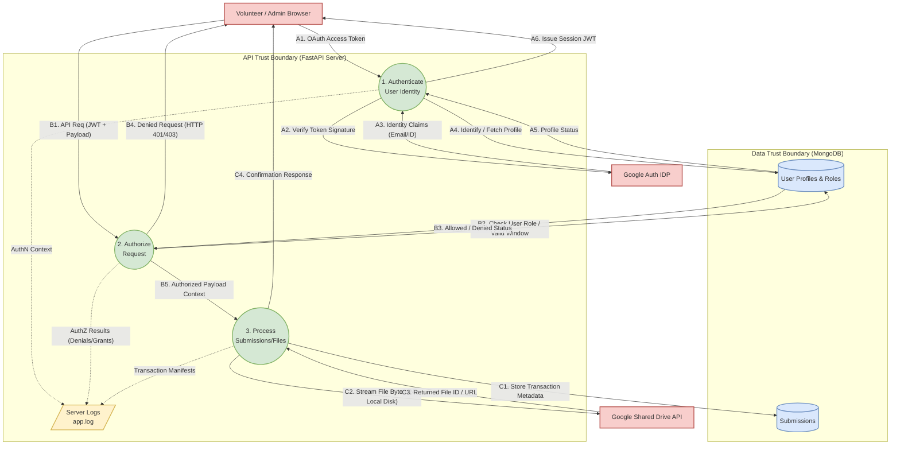

# Threat Modeling Data Flow & System Scope
**Project:** Guardian's Embrace Volunteer Portal
**Objective:** Architecture Threat Modeling (STRIDE & DFD Alignment)

---

## 1. Introduction
This guide maps out our system boundaries, how data moves through the app, and the trust levels we assign to different parts of our architecture. We designed this document to give security reviewers a clear, realistic picture of how our frontend, API, and databases interact. It's built specifically to help with Threat Modeling (like STRIDE methodology) by focusing on how we handle **Authentication (AuthN)**, **Authorization (AuthZ)**, and data moving between different trust zones.

---

## 2. Threat Modeling Data Flow Diagram (DFD)

The diagram below breaks down our architecture for threat modeling. We’ve color-coded it to make things easy to follow: 
* **Red Rectangles**: External systems and users.
* **Green Circles**: Action and processing steps.
* **Blue/Yellow Cylinders**: Where data and logs are stored.

This reflects exactly how our portal handles a user's request from start to finish.

---

## 3. System Scope & Trust Boundaries

To help the team spot potential risks (like Spoofing, Tampering, Repudiation, Information Disclosure, Denial of Service, or Elevation of Privilege), we've mapped out exactly what each part of our system does and how much we actually trust it.

### 3.1 The Client Browser (React SPA)
*   **What it does:** It runs our React web app, handles the user interface, puts together API requests, and kicks off the initial Google Sign-In redirect.
*   **Data it holds:** Temporary session tokens (JWTs) and whatever the user types into forms before they hit "submit."
*   **Trust Level: Untrusted.** 
    *   *Security Mindset:* We assume the browser is basically running in hostile territory. An attacker could fully manipulate or fake it.
    *   *What this means for our code:* We don't trust the frontend to enforce business logic, clean data, or check roles. The backend re-verifies absolutely everything.

### 3.2 Authentication & Authorization (FastAPI Middlewares)
*   **What it does:** This is our digital bouncer. It grabs incoming requests, double-checks Google ID tokens, issues our internal session tokens, and makes sure standard volunteers aren't trying to sneak into Admin-only areas.
*   **Data it holds:** It temporarily handles identity claims in memory and holds the secret signing key in its environment variables.
*   **Trust Level: High.** 
    *   *Security Mindset:* This is our frontline defense. If this gets bypassed, we're in big trouble.
    *   *What this means for our code:* This layer is critical. If our JWT secrets leak, attackers could elevate their privileges. We also have to watch out for denial-of-service (DoS) attacks if someone spams us with fake cryptographic requests.

### 3.3 Transaction Processing Engine (FastAPI Endpoints)
*   **What it does:** It runs our core business logic. It checks uploaded data strictly against Pydantic schemas (to stop injection attacks) and streams user file uploads straight to Google Drive so they never touch our local hard drive.
*   **Data it holds:** Active file streams and the details of volunteer submissions.
*   **Trust Level: High.**
    *   *Security Mindset:* We entirely trust this engine, but only because it exclusively processes requests that have already been cleared by the Authorization layer above it.

### 3.4 Google OAuth 2.0 (Identity Provider)
*   **What it does:** It handles all the messy password stuff, including Multi-Factor Authentication (MFA) and account recovery. It just hands over a verified "Yes, this is definitely them" token.
*   **Data it holds:** User passwords, MFA backup codes, and recovery contact info.
*   **Trust Level: High (External).**
    *   *Security Mindset:* We are fully offloading password security to Google. Our biggest blind spot here is if a user’s Google account gets hacked—our system wouldn’t natively know the difference.

### 3.5 MongoDB Atlas (Database)
*   **What it does:** This is our permanent record book. It stores user histories, system settings, and details about volunteer submissions.
*   **Data it holds:** Personally Identifiable Information (PII) like names and emails, plus all our internal system IDs.
*   **Trust Level: High.**
    *   *Security Mindset:* This database lives in a protected, isolated network space (VPC). 
    *   *What this means for our code:* Since this holds sensitive data, it's a prime target for breaches or data tampering. We strictly limit access so only the API server can talk to it.

### 3.6 Google Shared Drive (External File Storage)
*   **What it does:** It acts as the organization's long-term filing cabinet for anything volunteers upload.
*   **Data it holds:** The actual raw files and documents.
*   **Trust Level: High (External).**
    *   *Security Mindset:* We use a dedicated, locked-down Service Account to handle uploads so randos on the internet can't snoop through our files.
    *   *What this means for our code:* While the files are safe from outsiders, if a volunteer accidentally uploads a virus, Google Drive will store it. We don't currently have active anti-virus scanning intercepting those uploads.
